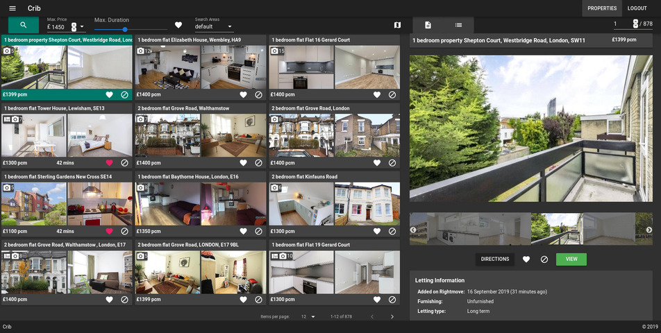
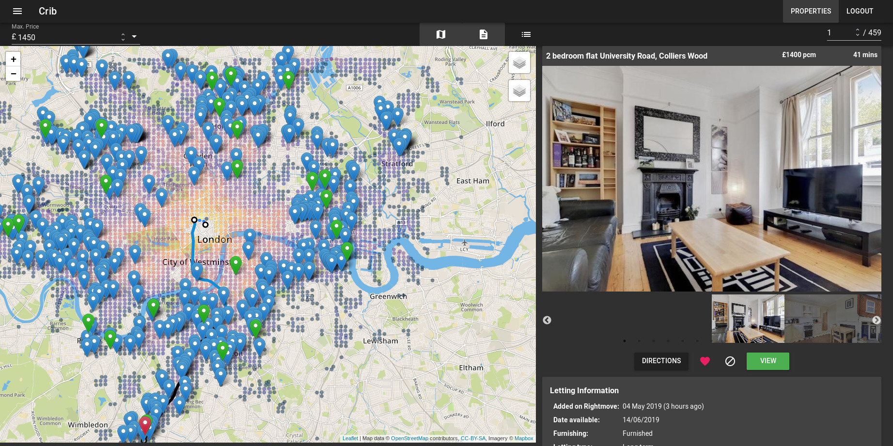

crib-web-ui
===========

The frontend for `crib <https://github.com/storax/crib>`_.

   Main view for viewing scraped properties.

   Map view with scraped routes to work.

Requirements
------------

- npm
- `parcel <https://parceljs.org/>`_

Usage
-----

Run the dev server::

  npm run dev
